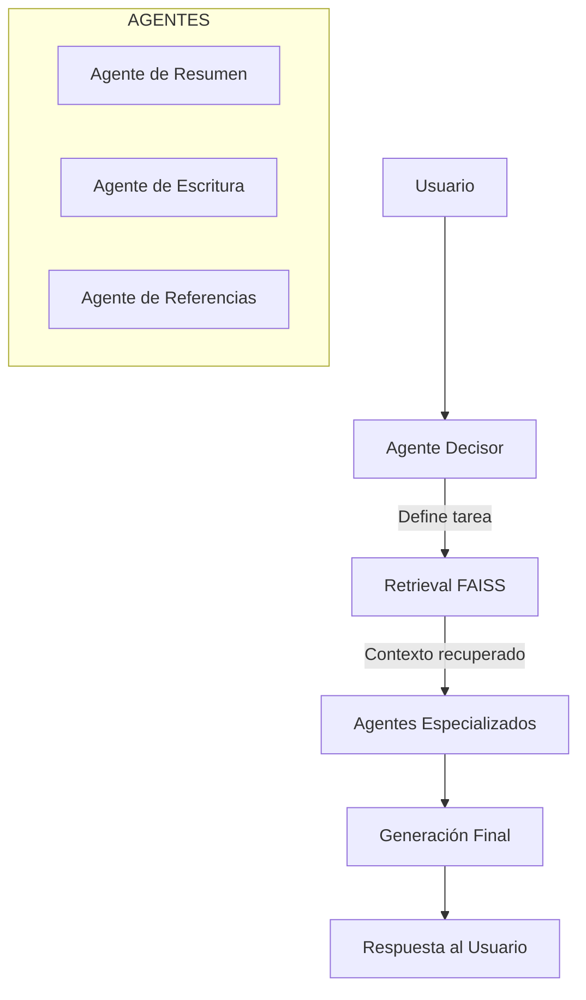
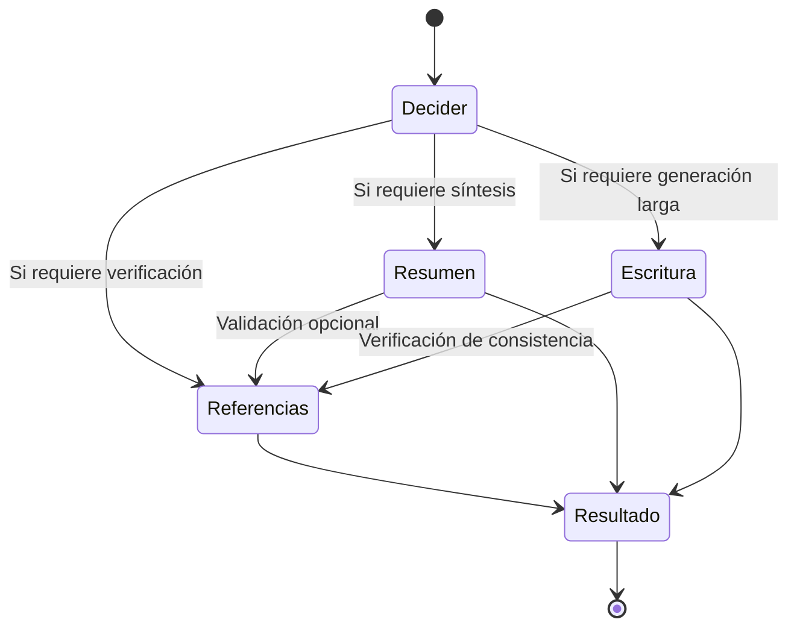

Aquí tienes una **versión completamente optimizada para reclutadores**, con **diagramas incluidos**, lenguaje profesional, y una estructura clara y atractiva para GitHub.
Todo es 100% compatible con Markdown.

---

# **RAG Multi-Agent System**

Este repositorio implementa un sistema RAG (Retrieval-Augmented Generation) basado en múltiples agentes especializados, capaz de realizar análisis documental, generación guiada de contenido y verificación con trazabilidad.
La arquitectura combina **FAISS** como motor de recuperación, **LangGraph** para orquestación de agentes y **OpenAI** como modelo generativo, con un enfoque modular, escalable y preparado para producción.

Este proyecto está diseñado para ser utilizado en aplicaciones de **document intelligence, chatbots avanzados, asistentes de investigación, automatización de análisis de texto y procesamiento contextual en tiempo real**.

---

# **1. Arquitectura General**

El sistema está dividido en tres capas principales: recuperación, agentes y orquestación.
A continuación se resumen en un diagrama de alto nivel.

## **Diagrama de Arquitectura**



---

# **2. Flujo de Ejecución Interno**

El sistema define su flujo mediante LangGraph, permitiendo ejecución determinista y estados controlados.

## **Diagrama de Flujo con LangGraph**



---

# **3. Componentes del Proyecto**

### **Capa de Recuperación**

* Almacenamiento vectorial con FAISS.
* Indexación de documentos y consultas por similitud.
* Preprocesamiento textual y normalización.
* Ubicada en `vector_storage/`.

### **Capa de Agentes**

Ubicados en `agentes/`:

* **Agente de Resumen:** Síntesis estructurada de información.
* **Agente de Escritura:** Generación de contenido extenso y contextual.
* **Agente de Referencias:** Validación de consistencia y trazabilidad.
* **Agente Decisor:** Determina el flujo del sistema dependiendo de la tarea.

### **Orquestación con LangGraph**

* Construcción del grafo en `langgraph_app/`.
* Flujo dirigido mediante estados y control de pasos.
* Integración con modelos de OpenAI.

---

# **4. Instalación y Configuración**

## **Requisitos**

* Python 3.10+
* API Key de OpenAI
* FAISS (se instala automáticamente desde pip)
* Docker (opcional)

## **Instalación**

```bash
git clone https://github.com/Brayton16/RAG.git
cd RAG
python -m venv venv
source venv/bin/activate   # Linux/Mac
venv\Scripts\activate      # Windows
pip install -r requirements.txt
```

## **Configuración**

Crear `.env`:

```
OPENAI_API_KEY=clave
```

---

# **5. Ejecución del Sistema**

```bash
python main.py
```

El script inicializa el grafo, carga FAISS y ejecuta el agente correspondiente según la instrucción del usuario.

---

# **6. Ejecución con Docker**

### Construcción

```bash
docker build -t rag-multiagent .
```

### Ejecución

```bash
docker-compose up
```

---

# **7. Estructura del Repositorio**

```
RAG/
│── agentes/
│── langgraph_app/
│── vector_storage/
│── main.py
│── Dockerfile
│── docker-compose.yml
│── requirements.txt
│── README.md
│── tests/
    ├── test_decider.py
```

---

# **8. Casos de Uso**

Este sistema puede emplearse para:

* Asistentes conversacionales con recuperación real.
* Análisis automatizado de documentos extensos.
* Generación de reportes basados en evidencia.
* Sistemas internos de investigación.
* Chatbots corporativos con trazabilidad.
* Procesos de auditoría documental.
* Plataformas de conocimiento empresarial.


# **9. Tecnologías Principales**

* **Python 3.10+**
* **LangChain / LangGraph**
* **FAISS Vector Store**
* **OpenAI LLMs**
* **Docker y Docker Compose**
* **PyTest**

